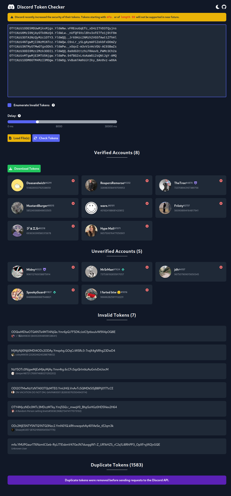

**Disclaimer:** This tool is for educational purposes only. I am not responsible for damages of any kind that are caused by using this tool.

## ❓ Information
This project is an open source tool which allows you to quickly check collect Discord token. You can easily export valid tokens and import text files containing tokens. 

## 💻 Features
- Load Discord tokens via files or paste them into the checker
- Check for working accounts, including badges and other account information
- Download valid tokens

## 📷 Demo 

## 📝 Contact
**Discord:** Janic#0474

## 📜 License
This project is under license: [MIT License](https://choosealicense.com/licenses/mit/)

